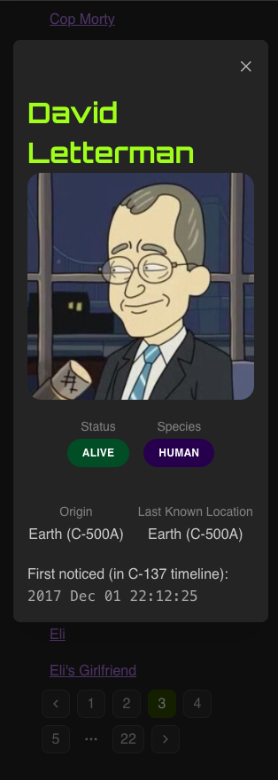

# Rick and Morty search party

A simple React app to view the character list of Rick and Morty!

# Final screenshots

# Packages used & reasoning
- [Mantine](https://mantine.dev/): used as the base design system to theme the site and build re-usable components.
- [dayjs](https://day.js.org/): used to format the date info from the API, avoiding internal JavaScript fns.
- React: essential for the SPA.
- [zod](https://zod.dev/): used to validate the schema of the incoming API data.
- [zustand](https://zustand-demo.pmnd.rs/): a simple state management tool to handle data handling across components.

Dev dependencies would include linters, bundler, types and test tools.

# Testing strategy
The `tests/` folder includes unit tests for the components used and the basic working.

# Development strategy
As this project aims to provide the solution for the provided requirements, test-driven development for the basic requirements were followed.

It is understood that there is scope of improvement in the aspects of query filtering, error handling & reporting, testing etc. Considering the time restrictions and scope of the project, the submission is being made.

# Design strategy
With respect to UI design, the aim was to remain as minimalistic until extended features are necessary.

The application architecture is single-page, due to the nature of the requirements but can be scaled up for multiple pages. The intent is to scale across different domains (locations, episodes) using this same architecture.
